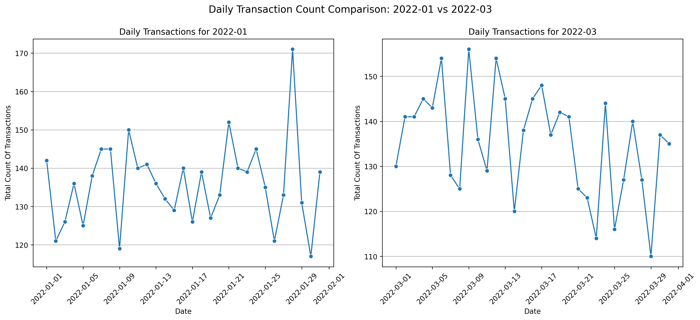
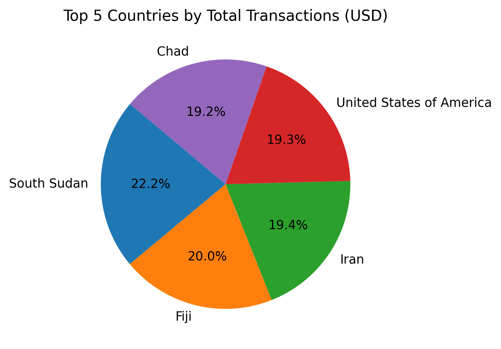
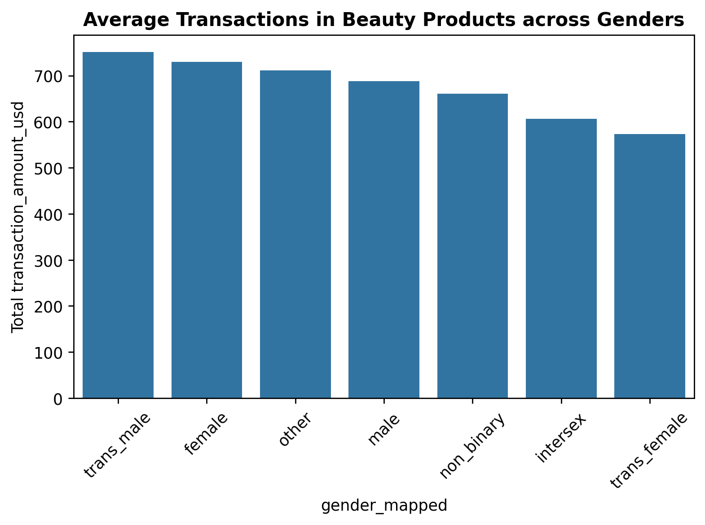
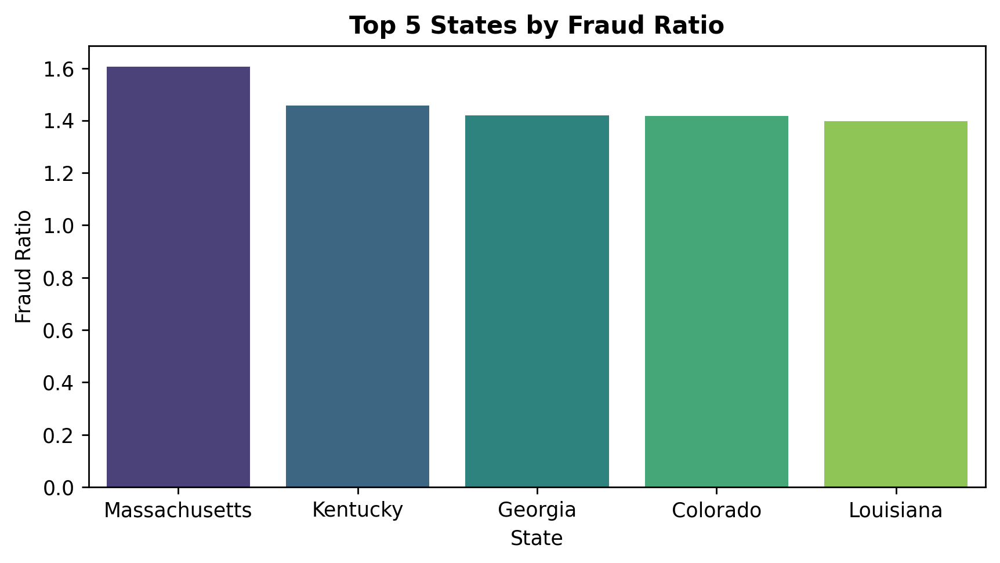
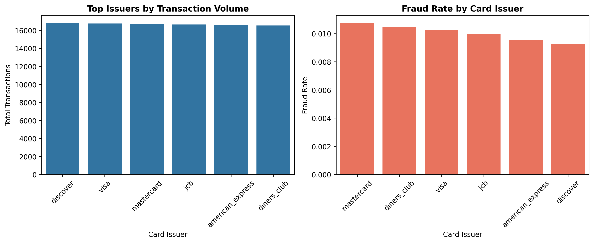

# 💳 Customer Transaction Analysis

### Data-Driven Insights for Risk and Fraud Operations

This project performs an end-to-end analytical study on transactional data to uncover behavioral, financial, and risk patterns across customer activity.  
It replicates the workflow of an **Investigation Specialist / Risk Analyst**, focusing on exploratory analytics, fraud ratio evaluation, and spending concentration across issuers, regions, and merchants.

---

## 🧭 Project Overview

### 🎯 Objective
To analyze customer-level transaction data and identify:
- Spending distribution and behavioral trends.
- Geographic and issuer-based concentration patterns.
- Indicators of fraudulent or abnormal transaction activity.
- Financial dependencies between key transactional variables.

### 🏢 Business Context
In a high-volume digital commerce environment, understanding how customers transact—where, when, and through which channels—helps businesses mitigate risk, optimize engagement, and maintain operational efficiency.  
This analysis builds structured visibility into those dimensions using descriptive and diagnostic analytics.

---

## 🧹 Data Collection & Preprocessing
- Dataset loaded and validated via pandas.  
- Null values imputed where required; no missing categorical data.  
- Duplicate transactions removed to ensure consistency.  
- Date columns standardized and converted to `datetime` objects.  
- Outliers in transaction amount retained (representing genuine high-value transactions).  
- Currency normalized to USD for analytical comparability.
- Gender columns was aligned to include all Genders.

> ⚠️ **Note:** The original dataset contained 100,000 transactions (~35 MB).  
> For performance and sharing purposes, a 20% representative sample (~10.0 MB) is included in this repository under `/data/sample_transactions.csv`.  
> All analytical logic, cleaning steps, and visualizations are consistent with the full dataset.

---

## 📊 Exploratory Data Analysis (EDA)

### Key Highlights
- Transaction volumes are stable across time with mild seasonal variation.  
- Geographic spending is concentrated across a few high-value countries.  
- Major card issuers (Visa, Mastercard, Diners Club) dominate both transaction count and spend.  
- Younger, high-credit-score customers represent a promising high-value segment.

**Representative Visuals:**

---

## 🔍 Analytical Insights

### Fraud & Risk Behavior
- Fraud ratios were low (<2%) but highest in **Massachusetts, Kentucky, and Georgia**.  
- Country-level anomalies observed in **Turks & Caicos**, **Ghana**, and **Haiti**.  
- Fraud probability showed no trend across customer tenure—fraud appears event-driven.

### Merchant & Payment Channel Insights
- **Visa, Mastercard, and Diners Club** contributed nearly equally to total spend (~$10–11M each).  
- Merchant-issuer combinations show concentration; potential nodes for operational focus.  

### Financial Correlations
- Moderate positive correlation between **claim and refund amounts (r≈0.41)**.  
- Refund amount unaffected by fraud status (p≈0.89).  
- Minimal relation between credit score and transaction value.

---

## 🧠 Key Takeaways
- Transaction ecosystem is **stable and low-risk**, with fraud occurrences scattered but minimal.  
- Operational exposure is **geographically and issuer concentrated**, suggesting areas for strategic monitoring.  
- Customer behavior is **consistent across demographics**, reinforcing data reliability.  

---

## 🧩 Tools & Libraries
- Python, Pandas, NumPy  
- Matplotlib, Seaborn  
- Scipy (for correlation & significance tests)  

